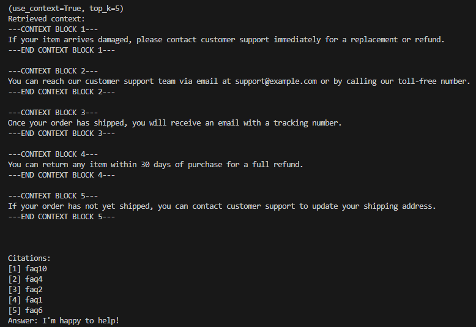

# Context Playbook v1

## Objective
1. Explain (Retrieve → Augment → Generate) using precise mental model language
2. Build a minimal Retrieval-Augmented Generation (RAG) pipeline locally (no hosted services)
3. Compare naive prompting vs RAG-augmented responses
4. Identify & log common RAG failure modes (irrelevant context, truncation, leakage)
5. Extend baseline with at least one improvement (better chunking, hybrid scoring, filtering)
# Log Results

# 1. Run baseline & capture one example answer

| **Query** | **Context** | **Answer** |
|------------|-------------|-------------|
| **How can I return a product?** | You can return any item within 30 days of purchase for a full refund. | Thank you for reaching out! According to our return policy, you can return any product within 30 days of purchase for a full refund. Additionally, if your item arrives damaged, please contact customer support immediately for a replacement or refund.  To initiate the return process, simply follow these steps:  1. Contact customer support to obtain a Return Merchandise Authorization (RMA) number. 2. Pack the item securely in its original packaging, if possible, and include all original accessories. 3. Affix the RMA number to the outside of the package. 4. Ship the package back to us at the address provided by customer support.  Once we receive your returned product, we will process a full refund within 5–7 business days.  If you have any further questions or concerns, please don't hesitate to reach out! |

| Query | Mode (raw/RAG) | k | Retrieved IDs | Strengths | Weaknesses | Failure Modes | Notes |
|-------|----------------|---|---------------|-----------|------------|---------------|-------|
Can I track my shipment?|RAG|1|1|Tight answer, fully addresses|Missed to complement with website or mail address.|partial|Given the context provided it responds related to the topic and concise.
Can I Track my shipment?|RAG|na|no context provided|it used keywords of the query to give an answer.|Gives a general answer based on tracking keyword.|partial|My understanding is that it used the word tracking to give a generic answer to the query.
Is there a bear in the living room?|RAG|3|3, faq10,faq9 and faq4|The query provided is out of the context of the dataset, it actually explains what the dataset is about.|Despite of the out of context query, it answers the questions, which would have been better to say, I cannot answer given the query and context.|Not sure which one applies.|Even with a question that is no related to the dataset information, the question is answered. Which I see risky since is better to respond that given the query and dataset or context, no answer is available.

## 🧭 Reflection Prompts

**Where did additional context hurt answer quality?**  
5 contexts were applied, two of them were not related to the question.  So increasing the context can provide information not related to the query. Can cause verbose due to the use of not related context.

**Which failure mode appeared most often?**  
partial and verbose

**What is your next improvement priority & why?**  
Provide more data to dataset so context can improve to have more accurate answers.

This is script output wiht context block delimitation and citations.

